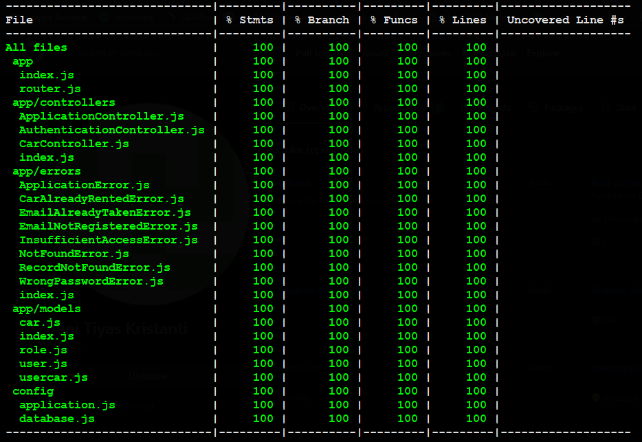

# Challenge Chapter 7

This project is about implemetation of Unit Testing with jest and supertest, deployment workflow with automated build using railways.app.

## Unit Test Coverage



## Database Diagram

I will visualize the erd, because i like visualizing something :D


## Admin Data

I have add admin data to seeder to endpoint check for CRUD operations

-   email : arief@binar.co.id
-   password : "123456"

## Accessing API Documentation

-   https://fsw-challenge-7-arief.up.railway.app/documentation

## First Setup

1. Install Library

```bash
yarn install
```

2. Create an .env file on root folder

```bash
JWT_SIGNATURE_KEY=Rahasia
DB_USER=
DB_PASSWORD=
DB_NAME=
DB_HOST=
DB_PORT=
```

3. Create Database

```bash
yarn db:create
```

4. Migrating the model

```bash
yarn db:migrate
```

5. Using seeder

```bash
yarn db:seed
```

## How To Test

-   Testing the app
    -   it will execute pre-script command to run on test mode

```bash
yarn test
```

## How To Run

-   Running Project on development

```bash
yarn develop
```
